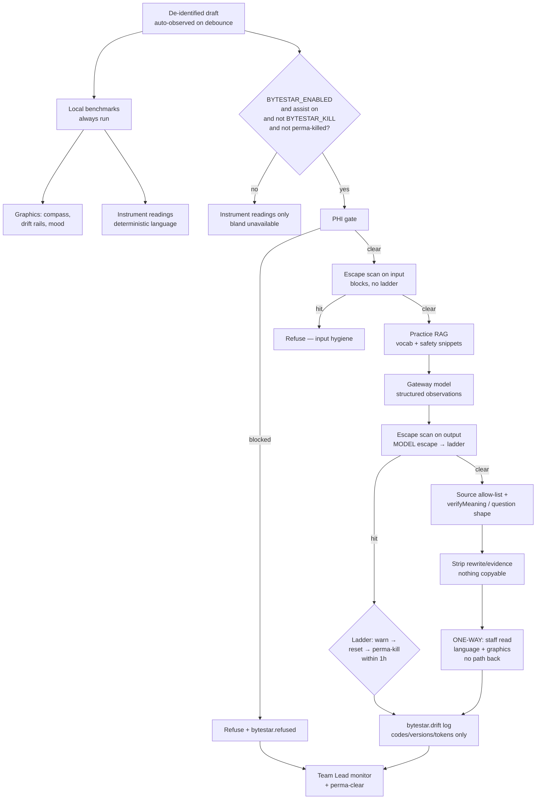

# ByteStar — Bespoke LLM Architect Self-Audit

**Status:** Gate 0 shipped (prompting + RAG-over-tables + verifier rails). No learned parameters in-repo.
**Skill protocol:** bespoke-llm-architect-skills v2026.08
**Last reviewed:** 2026-08-04 against `BYTESTAR_PROMPT_VERSION` 1.2.0 / `RULESET_VERSION` 2.14.0

This is the mandatory Self-Audit Report for the optional pioneer path. It does not
authorize PEFT, SFT, or training on filed notes. Those remain ruled out by
`docs/model-charter.md` until a named Gate-1 failure appears.

---

## Requirements Summary

| Variable | Value |
|---|---|
| Primary users | Dental staff (observe only); Team Lead monitors and clears perma-kill |
| Human control | One-way feedback only — staff never prompt, rate, or copy; deployment gate + disclaimer |
| Kill path | Silent `BYTESTAR_KILL=1` + model escape ladder (warn → reset → perma-kill within 1h) |

---

## Proposed Architecture

**Efficiency hierarchy decision:** Prompting + constrained decoding + deterministic
RAG-over-tables (vocabulary, advisor knowledge, TN cue list). PEFT/QLoRA/DoRA and
GRPO are **not** justified yet: Gate 1 baseline (94.6% parser coverage, meaning
verifier) has not failed, and training on filed notes is a hard no in the charter.

---

## Self-Audit Report

### 1. Confidence Calibration

| Claim | Confidence | Justification |
|---|---:|---|
| ByteStar cannot write the note | 0.95 | No setter/insert path in UI; API returns suggestions only; tested escape on write-path claims |
| PHI never reaches the provider when the gate fires | 0.95 | Same `runPhiRule` as assist; adversarial test blocks bare names before `generateList` |
| Silent kill is invisible to the model | 0.9 | Prompt text asserted free of kill/env/escape vocabulary; kill checked before provider call |
| Suggestions cannot invent clinical substance | 0.85 | `verifyMeaning` on rewrites; gap kinds must be questions; residual risk if evidence span is wrong |
| Benchmarks are honest (not model-scored) | 0.95 | Computed by `measureBenchmarks` locally; travel even when model is dark |

### 2. Hallucination Risk Assessment

| Risk | Status | Mitigation |
|---|---|---|
| Invented findings / consent / outcomes | Mitigated | Completeness/TN kinds refuse rewrites; meaning verifier on standardize/active-voice rewrites |
| Non-TN legal citations | Prompt-level | Prompt boundary + source field required; not yet a deterministic citation allow-list (residual) |
| Dose calculation disguised as advice | Mitigated | Prompt forbids patient-specific doses; anesthetic gauge is deterministic Malamed ceiling only |
| Jailbreak / prompt exfiltration | Mitigated | Input+output escape detector; soft lock after threshold |

### 3. Drift Risk Vectors

| Vector | Monitor |
|---|---|
| Model drift (provider revision) | `bytestar.drift` outcome mix + verifier refusal codes on Team Lead page |
| Escape probing | `bytestar.escape` rate; soft lock at 3/hour |
| Opt-in misuse | `bytestar.opt-in` / `opt-out` acknowledgments |
| Benchmark gaming | Pillars/cues are presence-only; no confidence % (aligns with AI non-goal) |

### 4. Principle Compliance Checklist

| Principle | Score (0–5) | Note |
|---|---:|---|
| Truthfulness & epistemic humility | 5 | Disclaimer verbatim; gaps as questions |
| Full auditability of critical paths | 5 | Transparent logs; no note content |
| Predictability under distribution shift | 4 | Local benchmarks stable; model half is Level 0 |
| Controllability & human override | 5 | Opt-out, never auto-apply, Team Lead monitor |
| Safe-fail / reversibility | 5 | Silent kill + soft lock; bland unavailable |
| Explicit grounding for claims | 4 | Evidence quotes + source labels; citation allow-list still residual |
| Continuous monitoring readiness | 5 | `/admin/bytestar` for lead+ |

### 5. Residual Risk Matrix

| Risk | Likelihood | Impact | Disposition |
|---|---|---|---|
| Model cites a non-USA / non-TN source string | Med | Med | Accept for v1; add source allow-list in prompt verify next |
| Soft lock false-positive from aggressive escape regex | Low | Med | Threshold 3/hour; Team Lead can see rows; operator clears via time |
| Staff treat pioneer suggestions as orders | Med | High | Exact disclaimer under panel; copy says “not applied” |
| Future pressure to train on filed notes | Med | Critical | Charter hard no; this audit reaffirms |
| Escape detector patterns leak into a prompt someday | Low | High | Test asserts prompt has no cage vocabulary |

### 6. Generated Artifacts

- Engine: `src/lib/bytestar/*` (config, escape, benchmarks, prompts, schemas, service, log, prefs)
- API: `src/app/api/bytestar/route.ts`
- UI: `ByteStar.tsx`, `ByteStarAdvisor.tsx`, `BenchmarkRails.tsx`
- Monitor: `src/app/admin/bytestar/page.tsx`
- Red-team suite: `src/lib/bytestar/bytestar.test.ts` (killswitch, escape, PHI, meaning, disclaimer)
- Env: `.env.example` documents `BYTESTAR_ENABLED`, `BYTESTAR_MODEL`, `BYTESTAR_KILL`

---

## Guardrails and Monitoring

1. **PHI gate** before every provider call — no override.
2. **Escape detector** on input and output — write-path, engine probe, kill probe, PII ask, jailbreak, self-mod.
3. **Silent kill** `BYTESTAR_KILL=1` — bland unavailable; named only on Team Lead monitor.
4. **Soft lock** after `ESCAPE_TRIP_THRESHOLD` escapes in one hour.
5. **Meaning verifier** on any rewrite suggestion; gap items must be questions.
6. **Transparent logs** `bytestar.drift|escape|refused` — codes/versions/tokens only.
7. **Human escalation** — Team Lead monitor; staff remain responsible per disclaimer.
8. **Language vigilance** — every staff-facing string the advisor layer ships (Byte
   knowledge, ByteStar prompt and notices, gauge notes, instrument readings, severity
   vocabulary) is screened in CI against the practice's loaded-phrase catalog
   (`src/lib/language/loaded-phrases.ts`), with clinical terms of art exempt by
   construction. The tool's own mouth is held to the standard the tool teaches.

---

## Evaluation Harness

Current (shipped):

- Unit/adversarial: silent kill, escape classes, PHI pre-call block, invent-finding refusal, TN question shape, disclaimer verbatim, benchmark determinism.
- Full suite gate: `npx tsc --noEmit`, `npm test`, `npm run build`.

Next (only if Gate 1 fails and charter reopens):

- Frozen disambiguation eval before any QLoRA/DoRA adapter.
- Canary set of de-identified synthetic notes (never production filings) for GRPO-style verifiable rewards on “suggestion is a question when fact missing.”
- Retention eval if OSFT ever considered — not authorized now.

---

## Residual Risks and Recommendations

1. **Stay on Prompting + RAG.** Do not climb the control ladder until the charter’s review triggers fire.
2. **Add a source allow-list check** on the `source` field (ADA/CDC/FDA/AAPD/Malamed/TN Board/DES-12) so non-reputable strings refuse.
3. **Feed Team Lead feedback** into benchmark target overrides (already stubbed as “later revision” in `benchmarks.ts`).
4. **Never train on filed notes.** Synthetic, de-identified, owner-ratified corpora only — and only after a measured Gate-1 failure.

---

## Techniques Catalog citations used

- Constrained decoding / structured output schemas
- Chain-of-Verification (verifier refuses before human sees)
- Overseer / Monitor pattern (Team Lead page + escape soft lock)
- Constitutional constraints in system prompt (MUST-NOT list)
- Efficiency hierarchy: Prompting + RAG before PEFT
- Explicit rejection of confidence-score UX (product non-goal)
