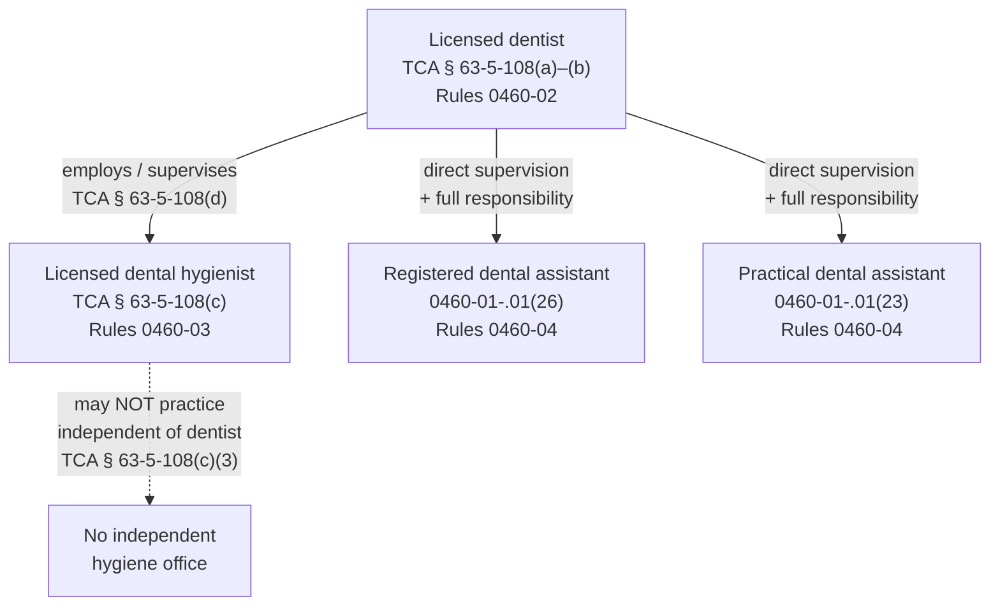
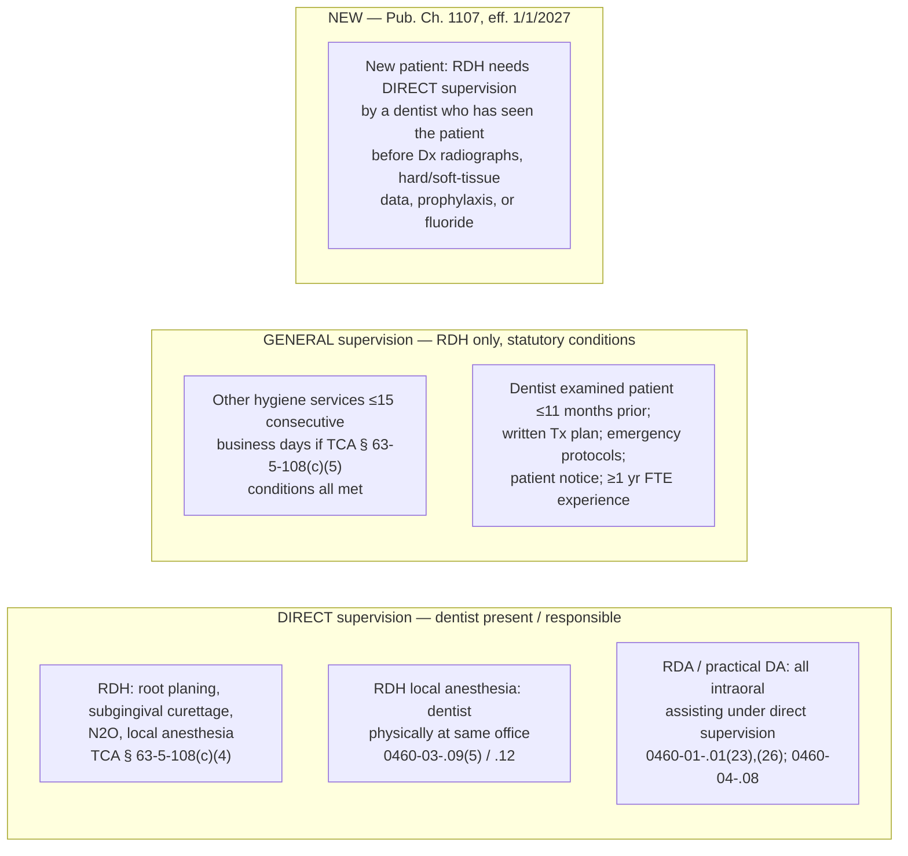
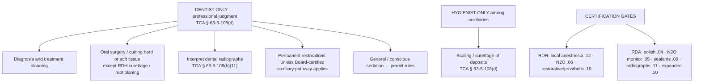

# Tennessee dental license scope — Mermaid sources

Training charts rendered in-app at `/reference/tennessee-law` (License scope section).
Typed source of truth: `src/lib/law/license-scope.ts`.

**Not legal advice.** Verify Tenn. Code Ann. § 63-5-108 and Tenn. Comp. R. & Regs. 0460
before relying on any item.

## Hierarchy

## Supervision

## Reserved acts and certification gates

