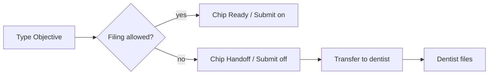

# UI / UX Inspection — Smile Notes (swarm pass)

**Build:** `main` @ post-#89/#90/#92 · **Branch:** `cursor/ui-ux-work-of-art-4966`  
**Method:** `/ui-and-ux-inspection` procedure + Chicken Little dual autopsy + Bespoke LLM Architect SuperByte audit  
**Evidence class:** code + existing automated tests (no production eye-tracking; no claim of measured usability uplift)

## Executive summary

Chairside trust was already improved by go-live honesty (Waiting for dentist, finishLine, once-per-browser feedback). This pass closes the remaining **status contradictions**: green Ready while Submit blocked, handoff banner that demanded transfer when filing was allowed, ProgressRing at 100% during handoff, toast covering Save/Submit, and action-bar Gestalt that buried the finish job under entry tools.

## Scope and limitations

- Routes: `/login`, `/`, `/note/:id`, `/workflow`, SuperByte aside.
- No live clinic session; findings labeled observed vs inferred.
- Automated inspection does **not** prove usability.

## Critical findings (shipped this pass)

| ID | Severity | Title | Status |
|---|---|---|---|
| UIX-001 | high | StatusChip Ready while filing blocked | **Fixed** — `handoff` status |
| UIX-002 | high | Handoff banner always demanded transfer | **Fixed** — scope vs transfer split |
| UIX-003 | moderate | ProgressRing 100% green ignoring filing | **Fixed** — cap 80% amber |
| UIX-004 | moderate | Action bar Gestalt weak on tablet | **Fixed** — finish first; Ways into disclosure |
| UIX-005 | high | Workflow modules chip wall open | **Fixed** — closed by default |
| UIX-006 | moderate | Fast Lane meaning title-only | **Fixed** — visible helper |
| UIX-007 | moderate | Toast covers Submit | **Fixed** — offset above action bar |
| SuperByte | moderate | Overclaim / ops copy / bubble weight | **Fixed** — observe copy, quieter tip, local gauges label |

## Critical-process step counts (proposal, unmeasured)

| Process | Before (observed) | After (proposed) |
|---|---|---|
| Hygienist clear audit, in-scope file | Chip Ready + banner transfer + Submit on | Chip Ready + quiet scope cue + Submit on |
| Hygienist needs dentist file | Chip Ready + Submit off + transfer banner | Chip **Dentist must file** + Submit off + transfer CTA |
| Finish on phone | Entry tools + Save/Submit wrap | Finish row dominant; entry under disclosure |

## Flows

## Accessibility

- Status not color-only (handoff has icon + label).
- Finish reason remains `aria-describedby` on Submit.
- ProgressRing aria-label names dentist filing when capped.
- Forced-colors / safe-area / 44px targets preserved in `globals.css`.

## Performance

- No new network calls. Pack fetch flicker deferred (Next).

## Privacy

- No change to PHI gates. SuperByte copy still forbids prompt/copy/feedback.

## Quick wins shipped

Listed above. Infra gate remains open PR **#91** (production `POSTGRES_URL`).

## Verification checklist

- [x] `deriveDraftStatus` handoff tests
- [x] ProgressRing filing cap tests
- [ ] Full `npm test` / `tsc` / `build` on branch
- [ ] Manual: hygienist in-scope vs out-of-scope chip + banner
- [ ] Manual: toast does not cover Submit on phone width

## KPIs (proposed experiment gates — not measured)

- Time-to-first-editable-field after login (exclude legal gate).
- Rate of Submit clicks while disabled (should fall after Andon honesty).
- Team Lead time to create a pack with ≤3 modules selected.
